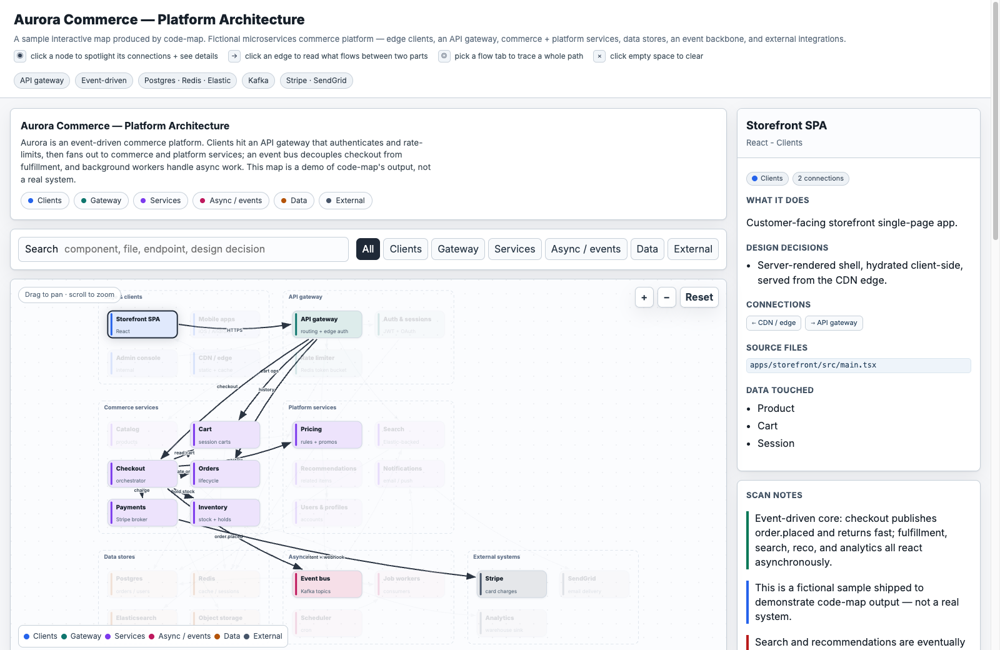

# code-map

A Claude Code plugin that turns a codebase scan into an **interactive, self-contained HTML
map** — a pan/zoom node graph with a clickable detail panel, search, layer filters, flow
walkthroughs, and matrices, where **every node is cited to a real file**.



> _Above: a sample map. Click a node to spotlight its connections and see its files; click an
> edge to read what flows between two parts; pick a flow tab to trace a whole path._

Two modes:

- **`architecture`** — the whole system at a glance.
- **`flow <topic>`** — one pipeline / business-logic path traced end to end.

The agent produces only the *data* (a `data.json`); a bundled generator validates it,
auto-lays-out the nodes, and injects it into a fixed rendering engine. No coordinate math,
no freehand HTML — the output is consistent every time.

## Install

**Option A — as a plugin (recommended):**

```bash
# point Claude Code at this repo as a plugin marketplace, then install
/plugin marketplace add <git-url-or-local-path>
/plugin install code-map
```

**Option B — drop the skill in directly** (no plugin machinery):

```bash
git clone <git-url> ~/.claude/skills/code-map-src
ln -s ~/.claude/skills/code-map-src/skills/code-map ~/.claude/skills/code-map
# or just copy skills/code-map/ into ~/.claude/skills/
```

**Local test before sharing:**

```bash
claude --plugin-dir /path/to/code-map-plugin
```

## Use

In Claude Code, from the repo you want to map:

```
/code-map architecture
/code-map flow billing-and-receipts
```

Or just ask in plain language — "map this codebase's architecture" / "show me the
auth flow as a diagram." The skill scans the repo, writes `data.json`, runs the generator,
and produces `architecture-map.html` (or `<topic>-map.html`). Open it in a browser.

## What it produces

A single HTML file (no build step, no server, no dependencies) with:

- a pan/zoom SVG node graph grouped into clusters and colored by layer;
- click a node → its purpose, design decisions, source files, and connections;
- click an edge → what flows between two parts;
- flow tabs that trace a whole path;
- a step-through walkthrough player;
- matrices (e.g. endpoints, tiers, factors) and scan notes.

## How it works

```
skills/code-map/
  SKILL.md              the scan → data playbook the agent follows
  template/engine.html  the fixed rendering engine (one /*__DATA__*/ injection point)
  scripts/generate.mjs  validate → auto-layout → inject → write HTML  (node, zero deps)
  reference/schema.md   the data.json contract
  examples/             known-good inputs
```

Run the generator directly if you already have a `data.json`:

```bash
node skills/code-map/scripts/generate.mjs data.json out.html
```

It hard-fails (with actionable messages) on dangling node references, empty clusters, or
malformed matrices — so a broken map can never be emitted silently.

## License

MIT.
